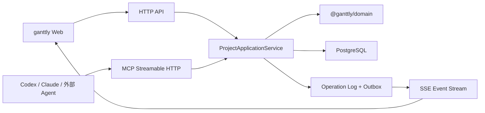

# ganttly 官方远端服务与 MCP 实施方案

| 字段     | 值                                                     |
| -------- | ------------------------------------------------------ |
| 文档状态 | Implementation Ready                                   |
| 创建日期 | 2026-08-12                                             |
| 目标读者 | 实现本需求的 coding agent、代码评审者、运维人员        |
| 适用范围 | 官方远端服务、可配置自建实例、远端工作区、MCP 任务管理 |

本文是官方远端服务与 MCP 功能的自包含交接文档。实现者应以本文锁定的产品边界、接口语义、数据规则和验收标准为准，不需要依赖此前的讨论记录。

---

## 0. 已裁定决策（2026-08-12 评审）

以下三项为本次评审锁定，**覆盖本文档中与之相关的旧描述**。后续章节中与这三项冲突的旧文字（如"标准 OIDC"）以本节为准。

1. **落地范围**：本轮交付 = 服务端代码完整 + 自建 Docker Compose 端到端走通。官方实例正式上线（域名 / 托管 PostgreSQL + PITR / 告警）作为"部署同一镜像"的后续运维 runbook，**不阻塞代码落地**。客户端内置"ganttly Cloud"入口 base URL 可配，默认指向开发实例。本文中"官方云服务"即指我们要实现的服务端本身。
2. **共享命令与撤销**：领域层只暴露纯函数 `applyProjectCommand`；Web 用通用 `toUndoable` 包装做快照式 invert，撤销体验不变。详见 §4.1。
3. **认证方式**：直接接 **GitHub OAuth**（`Sign in with GitHub`），数据库用 `(provider, subject)` 抽象，留标准 OIDC 作为未来非破坏性扩展。GitHub 不发 `id_token`、无 `/.well-known/openid-configuration`、无 `/userinfo`，故走 OAuth 授权码换码 + `GET /user` 取身份。详见 §8.2。

---

## 1. 背景与目标

ganttly 当前是纯前端、本地优先的甘特图应用：项目保存在浏览器 IndexedDB，并通过 `ProjectRepository` 抽象管理完整 `GanttlyFile` 文档。该形态具备无需登录、天然离线、零服务端依赖等传播优势，但独立进程中的 MCP Server 无法直接、安全地访问浏览器 IndexedDB。

本次建设的目标不是把 ganttly 改造成强制云端产品，而是在现有本地模式旁增加可选的远端工作区，使 Codex、Claude、钉钉机器人及其他 MCP Host 可以通过统一服务创建和管理任务。

### 1.1 产品目标

1. 保留当前本地工作区：无需登录、不联网、继续使用 IndexedDB。
2. 提供一个客户端内置的 ganttly 官方远端服务。
3. 支持用户添加符合 ganttly 实例协议的自建服务。
4. 用户登录远端实例后，可以查看和编辑该实例中的工作区与项目。
5. 本地项目可以显式“复制到远端”，复制后两份项目彼此独立。
6. 远端项目可以通过 MCP 查询、创建和修改任务。
7. Web、MCP 及未来其他入口共用同一套任务领域规则，不出现多套排期语义。
8. 官方服务和自建服务使用同一套 API、实例发现和 MCP 契约。

### 1.2 成功标准

- 未登录用户的本地项目和现有编辑流程不受影响。
- 用户可以连接官方服务，选择目标工作区，并将一个本地项目复制为远端项目。
- `RemoteRepository` 能以与本地 Repository 一致的方式完成项目列表、读取、保存、回收站和恢复。
- 并发保存不会静默覆盖，旧 revision 写入返回明确冲突。
- MCP Host 可以列出项目、查询任务、创建单个或批量任务、更新任务和管理依赖。
- MCP 重试不会重复创建任务；外部来源可通过稳定外部 ID 去重。
- MCP 写入后，已打开的 Web 页面能收到 revision 变化通知。
- 官方生产部署和自建 Docker Compose 部署运行同一份服务端代码。

### 1.3 明确非目标

首版不实现：

- ganttly 内置 AI 对话。
- 服务端模型调用、Prompt 管理或 Agent Runtime。
- 本地项目与远端副本的持续双向同步。
- 离线编辑队列及断网后自动合并。
- CRDT、OT 或多人实时共同编辑。
- 多标签页同时编辑同一项目的跨标签页同步或锁（见 §12.2）。
- 邮件、钉钉、日历等来源连接器；这些由外部 Agent 或自动化负责。
- MCP 永久删除项目或绕过回收站。
- 微服务拆分、Kafka 等分布式基础设施。
- 按任务拆分关系型表；首版仍以完整项目文档为聚合根。
- 计费、套餐、组织域名认领等商业化功能。

---

## 2. 已锁定的产品语义

### 2.1 工作区优先，而不是项目级存储选择

用户先选择工作区，再查看或创建项目。新建项目默认属于当前工作区，不在每次新建时重复询问“本地还是云端”。

层级模型：

```text
服务端实例（官方 / 自建）
  └── 工作区
        └── 项目
              └── 任务
```

本地模式在客户端中表现为一个特殊实例和工作区：

```text
instanceId = "local"
workspaceId = "local"
```

它不对应服务端记录，也不上传任何数据。

### 2.2 服务端实例交互

工作区切换器至少展示：

```text
本地工作区
  此设备上的项目

远端服务
  ganttly Cloud
  已添加的自建实例
  + 添加远端服务
```

官方实例是客户端内置项，普通用户无需填写地址；它可以退出登录，但不能从实例列表删除。自建实例由用户输入 HTTPS 地址后添加。

添加自建实例时必须先读取 `/.well-known/ganttly-instance`，显示实例名称和域名并由用户确认。发现失败、协议不兼容或地址不是 HTTPS 时不得进入登录流程。`localhost` 和回环地址仅作为开发例外。

客户端使用三元组唯一标识项目：

```ts
interface ProjectRef {
  instanceId: string;
  workspaceId: string;
  projectId: string;
}
```

不得继续假设 `projectId` 在全部实例中全局唯一。项目标签页、收藏、最近访问和路由都必须携带实例与工作区身份。

### 2.3 登录语义

- 本地工作区永远不要求登录。
- 每个远端实例单独登录、单独退出，Token 不跨实例复用。
- 官方实例和自建实例中相同邮箱不代表同一个系统身份。
- 不在 ganttly 中自建用户名/密码数据库；首版使用 GitHub OAuth，`(provider, subject)` 抽象留标准 OIDC 扩展点（§0 决策 3、§8.2）。
- Web 不把用户名、密码或长期访问令牌写入 `localStorage`。
- MCP 使用独立授权凭证，不能复用浏览器 Cookie 或用户密码。

首个可交付版本允许先使用有范围限制的 MCP Personal Access Token（PAT）。在面向不受控第三方客户端公开推广前，再增加标准 MCP OAuth；数据表和鉴权中间件必须为 OAuth principal 预留统一抽象。

### 2.4 复制到远端，而不是同步

本地项目操作菜单和编辑器项目菜单增加“复制到远端”。流程：

1. 若尚未连接实例，先连接官方服务或添加自建服务。
2. 选择目标实例和目标工作区。
3. 确认项目名称。
4. 展示任务、依赖、资源和基线数量摘要。
5. 上传并创建一个全新的远端项目 ID。
6. 本地项目完整保留。
7. 上传成功后默认打开远端副本。

界面使用“复制到远端”“上传副本”“上传并打开”，不得使用“同步”。远端项目页面可以提示“此项目由本地副本创建，之后与本地项目独立”。

复制请求必须带幂等键，网络重试不能产生多个远端项目。

### 2.5 MCP 的职责

MCP 只提供确定性的项目与任务工具，不在 MCP Server 内再次调用模型，也不提供 `manage_tasks(prompt: string)` 一类模糊工具。自然语言理解由 Codex、Claude、钉钉机器人等 MCP Host 完成。

---

## 3. 总体架构

首版采用模块化单体。所有入口共享 Application Service 与 Domain，不拆微服务。



### 3.1 技术选型

| 关注点          | 选型                                                                                                           |
| --------------- | -------------------------------------------------------------------------------------------------------------- |
| 运行时          | Node.js 20+、TypeScript strict、ESM                                                                            |
| HTTP 框架       | Fastify，保持模块化插件结构                                                                                    |
| 数据库          | PostgreSQL 16+                                                                                                 |
| SQL / Migration | Drizzle ORM + drizzle-kit；业务代码不得手写拼接 SQL                                                            |
| 项目文档校验    | 复用 `@ganttly/schema` 的 normalize + AJV 校验                                                                 |
| API/MCP DTO     | Zod，集中放在 `@ganttly/api-contract`                                                                          |
| MCP             | 官方 TypeScript MCP SDK，Streamable HTTP transport                                                             |
| Web 登录        | GitHub OAuth（confidential client + BFF，HttpOnly Session Cookie）；`(provider, subject)` 抽象留标准 OIDC 扩展 |
| 事件            | SSE + Transactional Outbox                                                                                     |
| 日志            | Fastify/Pino 结构化日志                                                                                        |
| 可观测性        | OpenTelemetry traces/metrics                                                                                   |
| 测试            | Vitest、Fastify inject、真实 PostgreSQL 集成测试、Playwright                                                   |
| 部署            | OCI 镜像；官方托管；自建 Docker Compose                                                                        |

不要在首版引入 Redis、NATS、Kafka、Elasticsearch或对象存储。单实例事件分发先使用 PostgreSQL `LISTEN/NOTIFY`；只有服务端横向扩容后确有需要时才增加 Redis 或 NATS。

### 3.2 建议目录

```text
ganttly/
├── apps/
│   ├── web/
│   └── server/
│       ├── src/
│       │   ├── bootstrap.ts
│       │   ├── config.ts
│       │   ├── plugins/
│       │   │   ├── auth.ts
│       │   │   ├── database.ts
│       │   │   └── observability.ts
│       │   └── modules/
│       │       ├── instance/
│       │       ├── identity/
│       │       ├── workspaces/
│       │       ├── projects/
│       │       ├── commands/
│       │       ├── events/
│       │       └── mcp/
│       └── tests/
├── packages/
│   ├── schema/
│   ├── calendar-data/
│   ├── domain/
│   └── api-contract/
└── deploy/
    ├── Dockerfile
    └── docker-compose.yml
```

`apps/server/modules/mcp` 只做 MCP 协议适配，不包含独立业务逻辑。现阶段无需创建单独的 MCP 业务包。

### 3.3 模块依赖规则

```text
@ganttly/schema ← @ganttly/domain ← apps/web
                                ← apps/server

@ganttly/api-contract ← apps/web
                      ← apps/server
```

- `@ganttly/domain` 可以依赖 `@ganttly/schema` 和 `@ganttly/calendar-data`。
- `@ganttly/domain` 不得依赖 React、Zustand、浏览器 API、Fastify、数据库或 MCP SDK。
- `@ganttly/api-contract` 只包含 DTO、错误码、实例发现和 MCP 输入输出 schema，不依赖服务端实现。
- `apps/server` 不得 import `apps/web` 中的 Store 或 Command。
- Web Command 和服务端 Application Service 应调用相同的领域函数。

---

## 4. 共享领域层

### 4.1 需要迁出的代码

**迁入 `packages/domain` 的纯函数文件**（`apps/web/src/lib` → `packages/domain/src`，`@/lib/*` 别名改为包内相对导入）：

`calendar`、`schedule`、`cpm`、`summary`、`cost`、`resourceLoad`、`assigneeSummary`、`resourceTasks`、`baseline`、`projectImport`、`taskPosition`、`deleteImpact`、`clipboard`、`selection`。

**留在 Web**（UI / engine / DOM 耦合）：`createTask`、`revealTask`、`fitProjectRange`、`zoomAround`、`taskFilter`、`*HoverHit`、`platform`、`shortcutTarget`、`toast`、`layoutPrefs`、`rowKeyboardNavigation`，以及整个 `engine/`。

`@ganttly/schema` 已是纯叶子包，`normalizeFile` / AJV 校验 / `createDefaultTask` 直接复用，无需迁移。

#### 纯函数命令模型

当前 `useProjectStore.ts` 中的 23 个 Command 工厂都用闭包变量在 `apply` 里捕获撤销状态、在 `invert` 里回放，**不可重入、不适合作为服务端领域 API**。新增纯函数命令模型，把 `apply` 的纯计算抽出来，撤销捕获留在 Web：

```ts
interface ApplyProjectCommandContext {
  now: string; // ISO，由调用方提供
  today: string; // YYYY-MM-DD，项目时区当天
  actorId: string;
}

interface Adjustment {
  field: string;
  from: unknown;
  to: unknown;
  reason: string; // 如 'non-working-day-snap' | 'dependency-cascade' | 'ancestor-rollup'
}

interface ApplyProjectCommandResult<TResult = CommandResult> {
  file: GanttlyFile;
  result: TResult; // 判别联合，携带 invert 所需数据（见下）
  affectedTaskIds: string[]; // 目标 + 祖先 rollup + 后继级联所有被改任务
  adjustments: Adjustment[]; // 吸附/级联/汇总等隐式变更，直接喂给 MCP §10.3
}

function applyProjectCommand(
  file: GanttlyFile,
  command: ProjectCommand,
  context: ApplyProjectCommandContext,
): ApplyProjectCommandResult;
```

`ProjectCommand` 覆盖现有 23 个命令语义。`result` 是**判别联合**，按命令类型携带 Web 撤销与服务端 operation 摘要所需的数据：

```ts
type CommandResult =
  | { kind: 'create'; createdTaskIds: string[] }
  | { kind: 'delete'; deletedTasks: Task[] }
  | { kind: 'update' | 'move' /* affectedTaskIds 已在顶层 */ }
  | { kind: 'dependency'; added?: Dependency[]; removed?: Dependency[] }
  | { kind: 'resource' | 'baseline' | 'viewState' /* ... */ };
```

函数必须纯、不可变且结果可复现。ID、`now` 和项目时区中的 `today` 由调用方提供，领域层不得直接读取系统时钟。`adjustments` 是命令本身产出（不是事后推断），同时服务 MCP 的"调整报告"和服务端 operation 日志摘要。

#### Web 撤销包装 `toUndoable`（决策 2）

Web 提供通用包装，把领域纯函数转成现有 `Command` 接口，撤销体验不变：

```ts
function toUndoable(command: ProjectCommand, ctx: ApplyProjectCommandContext): Command;
// apply:  const res = applyProjectCommand(file, command, ctx);
//         闭包缓存 res.result + 从 pre-apply file 快照受影响任务；
// invert: 按 res.result.kind 回滚——
//         create → 删除 createdTaskIds；delete → 重插 deletedTasks + 恢复受影响；
//         update/move → 恢复受影响任务字段；dependency → 移除/重加边。
```

等价于现有 `applyPatchAndCapture` / `restoreCaptured` / `repackSiblingOrders` / `assignOrders` 的捕获机制，但纯计算迁入 `@ganttly/domain`，闭包捕获留在 Web 包装层。23 个 command 工厂逐个改为 `return toUndoable(domainCommand, ctx)`。Web 的 `invert` 不需要服务端参与——服务端用 revision 快照 + 乐观并发，不做跨客户端 undo。

### 4.2 创建任务默认规则

无论 Web、HTTP Command 还是 MCP 创建任务，都遵守以下规则：

- `name` 去除首尾空格后不能为空。
- 未给 `start` 时使用项目时区中的当天。
- 开始日期落在非工作日时向后吸附到下一个工作日，并在返回结果中报告吸附。
- 普通任务默认 `duration = 1`；`end` 由项目日历计算。
- 里程碑强制 `duration = 0` 且 `start = end`。
- `progress` 默认 `0`，范围为 `0..100`。
- 未给位置时追加到目标父任务的最后。
- `parentId` 必须存在，且不能形成层级循环。
- 依赖前驱必须存在，禁止自依赖和依赖环。
- 新增或修改日期后，复用现有排期规则级联后继任务并更新祖先 rollup。
- 摘要任务的日期、工期和进度由子任务汇总，不接受直接覆盖这些派生字段。

### 4.3 批量创建

`create_tasks` 是单事务、全有或全无的命令，最多 100 项。输入项使用 `clientRef` 在同一批次内引用新父任务或新前驱任务：

```ts
interface CreateTaskItem {
  clientRef: string;
  name: string;
  parentTaskId?: string;
  parentRef?: string;
  start?: string;
  duration?: number;
  isMilestone?: boolean;
  progress?: number;
  note?: string;
  dependencies?: Array<{
    predecessorTaskId?: string;
    predecessorRef?: string;
    type?: 'FS' | 'SS' | 'FF' | 'SF';
    lag?: number;
  }>;
}
```

- `clientRef` 在一次请求中必须唯一。
- `parentTaskId` 与 `parentRef` 互斥。
- 前驱的 `predecessorTaskId` 与 `predecessorRef` 互斥。
- 允许输入任意顺序；服务端先解析引用并检测父子和依赖环，再一次提交。
- 任一项失败时不创建任何任务，返回指向 `clientRef` 的结构化错误。

---

## 5. 云端项目文档与 viewState

### 5.1 完整 JSONB 聚合根

首版 PostgreSQL 仍保存完整 `GanttlyFile` JSONB。原因：

- 与当前导入导出格式完全一致。
- 与现有 Repository 的原子保存语义一致。
- 避免在服务端第一版同时重写任务、依赖、资源、基线和日历模型。
- revision 冲突检测已经能防止静默覆盖。

暂不建立 `tasks`、`dependencies` 等关系表。MCP 搜索首版只支持指定项目内搜索，服务端加载一个项目文档后在内存中执行 O(n) 查询。

### 5.2 viewState 必须从共享 revision 中剥离

当前 `GanttlyFile.viewState` 包含缩放、滚动、选择和折叠状态。这些是用户个人视图，不能成为云端共享项目 revision 的一部分，否则用户滚动画布或选择任务都会与 MCP 写入产生冲突。

为保持 schema v1 兼容，服务端仍保存合法的 `GanttlyFile`，但 canonical document 中始终使用中性的默认 `viewState`：

```ts
const DEFAULT_REMOTE_VIEW_STATE: ViewState = {
  zoom: 'week',
  scrollLeft: 0,
  scrollTop: 0,
  selectedTaskId: null,
  showCriticalPath: false,
  collapsedTaskIds: [],
};
```

规则：

1. 远端导入和 PUT 时，服务端忽略客户端提交的 `viewState`，替换为默认值。
2. `RemoteRepository` 在浏览器本地按 `userId + ProjectRef` 保存实际视图状态。
3. GET 项目后，`RemoteRepository` 把本地视图状态合并到返回给 Store 的 `file`。
4. 保存前，`RemoteRepository` 移除本地视图差异，不让其进入远端 revision。
5. 首版不创建 `user_project_preferences` 表；将来需要跨设备同步个人视图时再增加该表。

**可测契约**（决策 2 配套，PR4 实现）：

- `RemoteRepository.loadProject`：GET 后，用本地 viewState（键 `userId:ProjectRef`）覆盖返回 `file` 的 viewState。
- `RemoteRepository.saveProject`：PUT 前，用 `DEFAULT_REMOTE_VIEW_STATE` 替换 `file.viewState`；保存响应后本地 viewState 不变。
- `setViewStateCommand` 只影响本地内存与本地 viewState 持久化，**不触发远端 revision、不产生远端 PUT**。
- 单测断言：滚动画布 / 选择任务不产生远端 PUT；远端 GET 不覆盖本地视图。

`meta.updatedAt` 由服务端在成功事务中生成。客户端时间不得成为云端排序依据。

### 5.3 导入时的元数据

复制本地项目到远端时：

- 创建新的远端 `projectId`。
- `meta.createdAt` 和 `meta.updatedAt` 均使用服务端当前时间。
- 保留项目业务内容、日历、任务、资源和基线。
- 重置 `viewState`。
- 本地源项目 ID、客户端 ID 和复制时间保存在服务端项目来源列中，不写入导出的业务 JSON。
- 不建立源项目与远端项目的同步关系。

---

## 6. 数据库模型

每个部署就是一个服务端实例，实例 ID 来自服务配置。因此业务表无需重复保存 `instance_id`；客户端通过实例 ID 和 base URL 区分不同部署。

所有公开 ID 使用带类型前缀的 nanoid，例如 `usr_`、`ws_`、`prj_`、`op_`、`evt_`、`pat_`。数据库安全不能依赖 ID 难猜，所有查询仍须校验工作区成员关系。

### 6.1 核心表

```text
users
  id text primary key
  provider text not null           -- 身份提供方，如 'https://github.com'；未来 OIDC 时存 issuer
  subject text not null            -- 该提供方下的稳定用户 ID
  email text null
  display_name text null
  created_at timestamptz not null
  updated_at timestamptz not null
  unique (provider, subject)

workspaces
  id text primary key
  name text not null
  kind text not null check (kind in ('personal', 'team'))
  created_by text not null references users(id)
  created_at timestamptz not null
  updated_at timestamptz not null

workspace_members
  workspace_id text not null references workspaces(id)
  user_id text not null references users(id)
  role text not null check (role in ('owner', 'admin', 'editor', 'viewer'))
  created_at timestamptz not null
  primary key (workspace_id, user_id)

projects
  id text primary key
  workspace_id text not null references workspaces(id)
  name text not null
  file_jsonb jsonb not null
  summary_jsonb jsonb not null
  revision bigint not null default 1
  source_type text null
  source_client_id text null
  created_by text not null references users(id)
  created_at timestamptz not null
  updated_at timestamptz not null
  deleted_at timestamptz null

project_operations
  id text primary key
  workspace_id text not null
  project_id text not null
  actor_type text not null check (actor_type in ('web', 'mcp', 'system'))
  actor_id text not null
  action text not null
  request_hash text null
  idempotency_key text null
  expected_revision bigint null
  result_revision bigint not null
  summary_jsonb jsonb not null
  response_jsonb jsonb null
  request_id text not null
  created_at timestamptz not null

outbox_events
  sequence bigserial primary key
  id text unique not null
  workspace_id text not null
  project_id text null
  type text not null
  payload_jsonb jsonb not null
  created_at timestamptz not null
  published_at timestamptz null

personal_access_tokens
  id text primary key
  user_id text not null references users(id)
  name text not null
  token_prefix text not null
  token_hash text not null
  scopes text[] not null
  workspace_id text null
  project_id text null
  expires_at timestamptz null
  last_used_at timestamptz null
  revoked_at timestamptz null
  created_at timestamptz not null

external_references
  workspace_id text not null
  project_id text not null
  provider text not null
  external_id text not null
  entity_type text not null check (entity_type in ('project', 'task'))
  entity_id text not null
  url text null
  created_at timestamptz not null
  primary key (workspace_id, provider, external_id, entity_type)
```

`summary_jsonb` 是由 `file_jsonb` 事务内计算的查询投影，不是第二份业务真相。项目列表不得每次扫描完整任务文档。

### 6.2 索引

至少建立：

- `projects(workspace_id, deleted_at, updated_at desc)`。
- `projects(workspace_id, lower(name))`。
- `project_operations(project_id, created_at desc)`。
- `project_operations(workspace_id, actor_type, actor_id, idempotency_key)` 条件唯一索引，其中 `idempotency_key is not null`。
- `outbox_events(workspace_id, sequence)`。
- `outbox_events(published_at, sequence)`。
- `personal_access_tokens(token_prefix)`。

### 6.3 工作区权限

| 操作               | viewer | editor | admin | owner |
| ------------------ | ------ | ------ | ----- | ----- |
| 查看工作区和项目   | 是     | 是     | 是    | 是    |
| 创建/修改任务      | 否     | 是     | 是    | 是    |
| 创建/复制/归档项目 | 否     | 是     | 是    | 是    |
| 恢复项目           | 否     | 是     | 是    | 是    |
| 管理成员           | 否     | 否     | 是    | 是    |
| 永久删除项目       | 否     | 否     | 否    | 是    |
| 删除工作区         | 否     | 否     | 否    | 是    |

PAT 和未来 OAuth Token 的有效权限是“Token scope 与当前用户工作区角色的交集”。用户被降权或移出工作区后，旧 Token 不得继续保留原权限。

### 6.4 幂等语义

所有非幂等 POST 都要求 `Idempotency-Key`。唯一范围为：

```text
(workspace_id, actor_type, actor_id, idempotency_key)
```

执行规则：

1. 计算规范化请求体的 SHA-256 `request_hash`。
2. 相同 key 且 hash 相同：返回首次保存的状态码和响应，不重复执行。
3. 相同 key 但 hash 不同：返回 `409 IDEMPOTENCY_CONFLICT`。
4. 幂等记录与项目修改在同一事务中写入。

外部 Agent 还可以为创建任务提交：

```ts
interface ExternalSource {
  provider: string;
  externalId: string;
  url?: string;
}
```

如果 `external_references` 已存在，则返回已有关联任务而不是再次创建。服务端只保存 URL，不主动抓取 URL 内容。

---

## 7. 事务与 Application Service

所有 Web Command 和 MCP 修改最终调用同一个 `ProjectApplicationService`。

### 7.1 完整文档保存

用于 `RemoteRepository.saveProject()`：

```text
校验身份和 workspace membership
  → normalizeFile
  → strip/replace viewState
  → AJV 校验
  → 校验文档限制和跨引用完整性
  → SELECT project FOR UPDATE
  → 比较 If-Match revision
  → 写 file_jsonb + summary_jsonb + revision + 1
  → 写 project_operations
  → 写 outbox_events
  → COMMIT
```

旧 revision 返回 `412 REVISION_CONFLICT`，并在错误详情中提供 `actualRevision`，不得自动 last-write-wins。

### 7.2 结构化项目命令

用于 MCP 和未来 Web 细粒度 API：

```text
校验身份、scope 和 workspace membership
  → 校验幂等键
  → SELECT project FOR UPDATE
  → 在最新 revision 上调用 applyProjectCommand
  → 校验结果文件
  → 写项目、operation 和 outbox
  → COMMIT
```

结构化命令默认作用于锁定时的最新 revision，不要求 Agent 预先读取并传回 revision。命令必须使用稳定任务 ID，并且只修改显式字段，因此比整文档覆盖更适合 Agent。响应返回新 revision 和受影响任务 ID。

### 7.3 操作日志边界

`project_operations` 用于审计、问题定位和幂等响应，不是首版跨客户端 undo 日志。记录：

- actor、来源、动作、revision 前后值。
- 任务 ID、字段名、影响数量等最小变更摘要。
- 请求 ID、幂等键和时间。

默认不记录完整项目 JSON、任务备注正文、Token 或 Cookie。Web 当前会话内的 undo/redo 仍由 Zustand history 管理；收到 MCP 的远端操作后清空或重建本地 history，不能让本地旧 Command 覆盖远端新快照。

---

## 8. 实例发现与认证

### 8.1 实例发现

每个实例公开：

```http
GET /.well-known/ganttly-instance
```

示例：

```json
{
  "protocol": "ganttly-instance",
  "protocolVersion": "1",
  "instanceId": "inst_official",
  "displayName": "ganttly Cloud",
  "baseUrl": "https://cloud.ganttly.com",
  "apiBaseUrl": "https://cloud.ganttly.com/api/v1",
  "webAppUrl": "https://app.ganttly.com",
  "mcp": {
    "url": "https://cloud.ganttly.com/mcp",
    "transport": "streamable-http",
    "authMethods": ["pat"]
  },
  "auth": {
    "browserModes": ["session"],
    "providers": ["github"]
  },
  "events": {
    "transport": "sse",
    "url": "https://cloud.ganttly.com/api/v1/events"
  },
  "apiVersions": ["v1"],
  "minClientVersion": "0.6.0",
  "features": {
    "projectImport": true,
    "mcp": true,
    "sse": true,
    "teamWorkspaces": false
  }
}
```

要求：

- URL 字段返回绝对 HTTPS URL。
- `instanceId` 安装后稳定，不随域名显示名变化。
- 不返回 Token、用户信息和内部网络地址。
- 客户端校验协议版本、最低客户端版本和 URL scheme。
- 自建实例的 `webAppUrl` 可以等于 `baseUrl`。
- 官方服务不得充当任意自建 URL 的代理；发现请求由浏览器直接访问，防止 SSRF。

### 8.2 Web 登录（GitHub OAuth）

决策 3：首版登录用 GitHub OAuth（`Sign in with GitHub`）。GitHub 不是标准 OIDC 提供方（不发 `id_token`、无 `/.well-known/openid-configuration`、无 `/userinfo`），因此走 OAuth 授权码流程 + `GET /user` 取身份。数据库抽象放宽为 `(provider, subject)`（§6.1），未来接标准 OIDC 时 `provider` 存 issuer，是非破坏性扩展。

服务端作为 confidential client + BFF，登录态用 HttpOnly、Secure、SameSite=Lax 的服务端 Session Cookie 保存，不在浏览器存 access token 或长期 refresh token。

流程：

1. 用户点"用 GitHub 登录"→ 服务端生成 `state`（+nonce），重定向到 `https://github.com/login/oauth/authorize?client_id=...&redirect_uri=...&state=...&scope=read:user`（需取私有邮箱时加 `user:email`）。
2. GitHub 回跳带 `code` + `state` → 服务端校验 `state`，`POST https://github.com/login/oauth/access_token`（带 `client_secret`）换取 access_token。
3. `GET https://api.github.com/user` 取 `{ id, login, name, email, avatar_url }`。
4. upsert `users(provider='https://github.com', subject=String(id))`；首次登录自动创建一个 `kind=personal` 个人工作区和 owner membership。首版只开放个人工作区 UI，但数据库和授权按多工作区建模。
5. 建立服务端 Session（sessionId → userId），下发安全 Cookie。

部署模式：

- 官方：`app.ganttly.com` 同站反代访问官方 API，Session Cookie 同源。
- 自建：同一个容器同源托管 Web、API、MCP，Session Cookie 同源。管理员在 GitHub 创建 OAuth App，填回调 URL 与 `GITHUB_OAUTH_CLIENT_ID` / `GITHUB_OAUTH_CLIENT_SECRET` 即可，无需额外 IdP 组件。

开发环境允许显式 `AUTH_MODE=dev` 注入固定测试用户；生产环境启动时若使用 dev auth 必须直接失败。

> **未来扩展（非首版）**：当需要 Google、企业 SSO 等，可接入标准 OIDC 提供方（自建 Zitadel / Authentik / Keycloak，或托管 Auth0 / Logto），由其联邦 GitHub 等社交登录；ganttly 服务端只需把 `provider` 当 OIDC issuer 处理，现有 `(provider, subject)` 映射与鉴权中间件不变。

### 8.3 MCP PAT

首版 MCP 设置页允许用户创建 PAT：

- 名称。
- 目标工作区，项目范围可选。
- scope。
- 过期时间。

scope 固定为：

```text
workspace:read
project:read
task:write
project:archive
```

Token 使用至少 256 bit 随机熵，只显示一次。数据库仅保存前缀和 `SHA-256(token + server pepper)`，日志中禁止出现明文。PAT 可以撤销，并记录 `last_used_at`。

未来增加 MCP OAuth 时，实现以下标准发现端点，并将 OAuth principal 适配为与 PAT 相同的 `AuthPrincipal`：

```text
/.well-known/oauth-protected-resource
/.well-known/openid-configuration
```

---

## 9. HTTP API v1

API Base：`/api/v1`。所有日期时间使用 UTC ISO 8601，项目内日期继续使用 `YYYY-MM-DD`。

### 9.1 错误结构

```ts
interface ApiErrorResponse {
  error: {
    code:
      | 'AUTH_REQUIRED'
      | 'FORBIDDEN'
      | 'NOT_FOUND'
      | 'VALIDATION_FAILED'
      | 'REVISION_CONFLICT'
      | 'IDEMPOTENCY_CONFLICT'
      | 'LIMIT_EXCEEDED'
      | 'UNSUPPORTED_CLIENT';
    message: string;
    details?: unknown;
    requestId: string;
  };
}
```

HTTP 映射：认证 `401`，权限 `403`，不存在 `404`，验证 `422`，幂等冲突 `409`，revision 冲突 `412`，大小限制 `413`，限流 `429`。

### 9.2 身份与工作区

```text
GET  /me
GET  /workspaces
GET  /workspaces/:workspaceId
```

团队工作区的创建、邀请和成员管理不属于首个 UI 版本；保留路由空间，不需要先实现空接口。

### 9.3 项目

```text
GET    /workspaces/:workspaceId/projects
POST   /workspaces/:workspaceId/projects
POST   /workspaces/:workspaceId/projects/import
GET    /workspaces/:workspaceId/projects/:projectId
PUT    /workspaces/:workspaceId/projects/:projectId
POST   /workspaces/:workspaceId/projects/:projectId/commands
POST   /workspaces/:workspaceId/projects/:projectId/archive
POST   /workspaces/:workspaceId/projects/:projectId/restore
DELETE /workspaces/:workspaceId/projects/:projectId
```

约束：

- 列表默认不含回收站；使用 `?deleted=true` 查看回收站。
- GET 项目返回 `{ summary, file, revision }`，同时返回 `ETag: "<revision>"`。
- PUT 要求 `If-Match`，body 为 `{ file }`。
- archive/restore 要求 `Idempotency-Key`。
- DELETE 只允许 owner 永久删除已归档项目，MCP 不暴露该能力。
- 项目允许重名。

导入请求：

```ts
interface ImportProjectRequest {
  name: string;
  file: GanttlyFile;
  sourceClientId?: string;
}
```

响应：

```ts
interface ProjectSnapshotResponse {
  summary: ProjectSummary;
  file: GanttlyFile;
  revision: string;
}
```

### 9.4 文档限制

首版默认限制，均由服务端配置集中定义：

- HTTP JSON body 最大 10 MiB。
- 每个项目最多 10,000 个任务。
- 每个项目最多 2,000 个资源。
- 每个项目最多 100 条基线。
- 一次批量创建最多 100 个任务。
- MCP 单次响应最大 1 MiB；过大内容返回摘要和分页信息。

不要在多个路由中散落硬编码数字。

---

## 10. MCP v1

端点：

```text
POST /mcp
```

使用 Streamable HTTP，尽量保持无状态。鉴权解析为：

```ts
interface AuthPrincipal {
  actorType: 'user' | 'pat' | 'oauth_client';
  actorId: string;
  userId: string;
  scopes: string[];
  workspaceId?: string;
  projectId?: string;
}
```

### 10.1 工具集合

首版工具：

```text
list_workspaces
list_projects
get_project
search_tasks
get_task
create_task
create_tasks
update_task
move_task
add_dependency
remove_dependency
```

不暴露任意 JSON Patch、任意 `customFields` 覆盖、SQL、文件系统、网络抓取和永久删除。

### 10.2 读取工具

`list_projects` 输入 `workspaceId` 和可选 query，返回项目摘要，不返回完整 `file_jsonb`。

`get_project` 返回项目摘要、日历 ID、任务/资源/基线数量和 revision，不默认返回全部任务。

`search_tasks` 必须指定 `workspaceId + projectId`，支持：

- 名称和备注的大小写不敏感子串搜索。
- `parentTaskId`、进度范围、日期范围、负责人筛选。
- `limit` 默认 50、最大 200。
- 游标分页。

`get_task` 返回完整单任务字段、父任务摘要、前驱和直接子任务摘要。

### 10.3 create_task

```ts
interface CreateTaskToolInput {
  workspaceId: string;
  projectId: string;
  name: string;
  parentTaskId?: string;
  afterTaskId?: string;
  start?: string;
  duration?: number;
  isMilestone?: boolean;
  progress?: number;
  note?: string;
  color?: string;
  assignments?: Array<{ resourceId: string; load: number }>;
  dependencies?: Array<{
    predecessorTaskId: string;
    type?: 'FS' | 'SS' | 'FF' | 'SF';
    lag?: number;
  }>;
  source?: ExternalSource;
  idempotencyKey: string;
}
```

- `afterTaskId` 必须与最终父任务属于同一 sibling 集合。
- 未给 `afterTaskId` 时追加到末尾。
- `source` 命中已有 external reference 时返回已有任务，`created=false`。

响应至少包含：

```ts
{
  created: boolean;
  task: Task;
  revision: string;
  affectedTaskIds: string[];
  adjustments: Array<{
    field: string;
    from: unknown;
    to: unknown;
    reason: string;
  }>;
}
```

`adjustments` 用于明确报告非工作日吸附、依赖排期和祖先汇总等服务端调整，避免 Agent 误以为输入被原样保存。

### 10.4 update_task

允许更新：

- `name`、`start`、`duration`、`progress`、`isMilestone`。
- `note`、`color`、`overtimeDates`。
- `constraints`、`assignments`。

禁止通过该工具更新：

- `id`、`parentId`、`order`；使用 `move_task`。
- `dependencies`；使用依赖工具。
- 任意 `customFields`；后续以命名空间白名单扩展。

输入必须包含 `idempotencyKey`。空 patch 返回验证错误，不创建 revision。

### 10.5 move_task

输入 `taskId`、`newParentTaskId` 和 `position`：

```ts
type MovePosition =
  | { kind: 'first' }
  | { kind: 'last' }
  | { kind: 'before'; taskId: string }
  | { kind: 'after'; taskId: string };
```

服务端归一化所有受影响 sibling 的 `order`，禁止移动到自身后代中，并重新计算旧、新祖先 rollup。

### 10.6 依赖工具

`add_dependency` 输入 successor task、predecessor task、type 和 lag。添加前执行循环检测，并根据项目日历满足依赖、级联后继。

`remove_dependency` 使用 successor task 与 predecessor task 定位边；删除依赖不自动把任务日期向前拉回，只移除约束关系。该语义与现有 UI 保持一致。

### 10.7 MCP 返回与错误

- Tool 返回使用结构化内容，同时提供简短人类可读摘要。
- 业务错误不得伪装为协议异常；返回稳定错误 code、字段路径和修复建议。
- 不把完整项目、Token、内部堆栈或 SQL 错误发给 MCP Host。
- 所有写工具记录 `actor_type=mcp`、Token ID 和 operation ID。

---

## 11. 事件通知

### 11.1 SSE 端点

```text
GET /api/v1/events?workspaceId=:workspaceId
```

使用 `Last-Event-ID` 恢复。事件只发送变化摘要，不发送完整项目：

```json
{
  "id": "evt_xxx",
  "type": "project.updated",
  "workspaceId": "ws_xxx",
  "projectId": "prj_xxx",
  "revision": "43",
  "actor": {
    "type": "mcp",
    "id": "pat_xxx"
  },
  "operationId": "op_xxx",
  "createdAt": "2026-08-12T10:00:00.000Z"
}
```

事件类型首版包括：

```text
project.created
project.updated
project.archived
project.restored
```

### 11.2 Transactional Outbox

项目、operation 和 outbox event 必须在同一 PostgreSQL 事务中提交。后台发布循环：

1. `FOR UPDATE SKIP LOCKED` 获取未发布 outbox。
2. 通过实例内 event bus 发布。
3. 设置 `published_at`。
4. 多进程部署时用 PostgreSQL `LISTEN/NOTIFY` 唤醒各实例。

保留事件游标至少 7 天。客户端请求的 `Last-Event-ID` 已过期时发送 `resync_required`，随后客户端重新拉取项目列表和当前项目快照。

### 11.3 Web 收到远端变化

- 当前项目无未保存修改：重新加载快照，清空旧 undo/redo history。
- 当前项目有未保存修改：不覆盖，显示“远端有更新”，允许用户重新加载。
- PUT 返回 revision conflict：保留本地内存态，显示冲突而不是自动重试整文档。
- 非当前项目变化：只刷新项目摘要。
- SSE 断线：指数退避重连，重连前先校验当前 revision。

---

## 12. Web 客户端改造

### 12.1 Store 与 Repository

新增：

```ts
interface InstanceConfig {
  id: string;
  displayName: string;
  baseUrl: string;
  kind: 'official' | 'custom';
}

interface WorkspaceSummary {
  id: string;
  instanceId: string;
  name: string;
  kind: 'personal' | 'team';
  role: 'owner' | 'admin' | 'editor' | 'viewer';
}
```

客户端维护：

- Instance Registry：官方实例常量 + 用户确认过的自建实例。
- Auth Store：每个实例独立的登录状态。
- Workspace Store：当前实例/工作区及列表。
- Repository Factory：本地返回 IndexedDB Repository，远端返回绑定 instance/workspace/auth 的 `RemoteRepository`。

保持现有 `ProjectRepository` 方法尽量不变，由具体 Repository 实例绑定工作区，避免给每个方法重复增加 `workspaceId`。

### 12.2 导航状态

`OpenProjectTab`、收藏和最近访问从 `projectId` 改为 `ProjectRef`。导航偏好仍保存在浏览器本地，不进入项目 JSON。

**localStorage 键命名空间化**：当前布局偏好键 `ganttly:preferences:panel-widths:<projectId>`、`column-widths:<projectId>` 直接用裸 `projectId`，多实例下会冲突。改为 `:<instanceId>:<workspaceId>:<projectId>`（在 `layoutPrefs.ts`），并提供旧键一次性迁移；全局项如 `drawer-width` 保持不变。

推荐统一路由：

```text
/instances/:instanceId/workspaces/:workspaceId/projects
/instances/:instanceId/workspaces/:workspaceId/projects/:projectId
```

为现有链接保留重定向：

```text
/projects/:projectId
  → /instances/local/workspaces/local/projects/:projectId
```

如果链接中的自建 `instanceId` 尚未在本机注册，页面要求用户输入实例 URL；发现结果的 ID 必须与链接匹配后才能继续。

**全局单例与多标签页**：`useProjectStore` 的模块级 `saveTimer` / `savePromise` / `loadGeneration` 假设同一时刻只有一个活动项目——它们已按 `activeProjectId` 做防 stale 校验，切换工作区前 `flushPendingSave` 不变。**v1 明确：同一标签页内单一活动项目；多标签页同时编辑同一项目不在首版范围**（不引入跨标签页 BroadcastChannel 或锁），写入 §1.3 非目标。

### 12.3 项目中心

- 顶部增加工作区切换器。
- 项目卡显示“本地”或远端实例/工作区标识。
- “新建项目”只在当前工作区创建。
- 本地项目菜单增加“复制到远端”。
- 远端项目不显示“同步到本地”；用户仍可通过现有 JSON 导出获得本地文件。
- 切换工作区前必须 flush 当前待保存项目；保存失败时阻止切换。

### 12.4 RemoteRepository

`RemoteRepository` 必须：

- 使用 HTTP ETag 作为 opaque `ProjectRevision`。
- `If-Match` 保存，`412` 映射为现有 `RevisionConflictError`。
- 合并/剥离本地 viewState。
- 将 `401/403/404/422/429` 映射为可显示的 typed errors。
- 支持 AbortSignal，项目快速切换时取消旧请求。
- 不在 Repository 内静默重试非幂等请求。

### 12.5 复制到远端

上传前在客户端使用现有 normalize/validate 预检；服务端仍需再次校验。请求使用一次生成并保存到对话框状态的幂等键，网络重试复用同一个 key。

上传成功后：

1. 刷新目标工作区项目列表。
2. 写入该工作区最近访问和标签页。
3. 导航到远端项目。
4. 不修改或删除本地项目。

---

## 13. 安全要求

必须实现：

- HTTPS 与 HSTS；开发 `localhost` 例外。
- Secure、HttpOnly、SameSite Cookie；Cookie 写请求校验 Origin/CSRF。
- 跨 Origin OAuth 使用 PKCE、state、nonce、issuer 和 audience 校验。
- CORS 使用实例配置的明确 Origin 白名单，不允许凭据模式下的 `*`。
- 每个查询先校验 workspace membership，防止 IDOR。
- API/MCP 按 IP、用户和 Token 三个维度限流。
- 请求体、任务数量、批量数量和响应大小限制。
- PAT 不跨实例复用，明文不落库、不进日志。
- 服务端绝不执行任务文本中的指令，也不基于任务 URL 发起网络请求。
- MCP 不提供任意 SQL、Shell、文件或网络工具。
- 日志不记录 Cookie、Authorization Header、完整项目 JSON 和任务备注正文。
- 备份加密，并支持用户导出项目数据和删除账号数据。
- 生产数据库使用最小权限账号；迁移账号与运行账号可以分离。
- 依赖漏洞扫描和容器非 root 运行。

PostgreSQL Row-Level Security 可以作为额外防线，但不能替代应用层授权。若首版启用 RLS，所有请求事务必须设置可信的当前用户/工作区上下文，并为后台 migration/outbox 使用独立角色。

---

## 14. 运维与自建

### 14.1 官方部署

```text
CDN / Ingress
  └── stateless ganttly-server replicas
        └── Managed PostgreSQL with PITR
```

数据库迁移作为独立发布步骤运行，生产进程启动时不得自动执行不可控 migration。部署顺序使用 expand/migrate/contract，保证滚动升级时新旧实例短暂并存仍兼容。

### 14.2 自建 Docker Compose

首个自建包只包含：

```text
ganttly-server
postgres
```

服务端容器同时提供 Web 静态资源、API、MCP、SSE 和实例发现，以获得默认同源体验。自建管理员必须配置 GitHub OAuth（创建 GitHub OAuth App 并填回调 URL + `GITHUB_OAUTH_CLIENT_ID/SECRET`）；仅开发示例允许 dev auth。

核心环境变量：

```text
DATABASE_URL
PUBLIC_BASE_URL
WEB_APP_URL
GANTTLY_INSTANCE_ID
GANTTLY_INSTANCE_NAME
GITHUB_OAUTH_CLIENT_ID        # GitHub OAuth App
GITHUB_OAUTH_CLIENT_SECRET
SESSION_SECRET
TOKEN_PEPPER
ALLOWED_WEB_ORIGINS
LOG_LEVEL
MAX_PROJECT_BYTES
MAX_PROJECT_TASKS
# 未来扩展（非首版，接入标准 OIDC 提供方时启用）：
# OIDC_ISSUER / OIDC_CLIENT_ID / OIDC_CLIENT_SECRET
```

提供：

```text
pnpm --filter @ganttly/server migrate
pnpm --filter @ganttly/server start
```

以及健康检查：

```text
GET /health/live
GET /health/ready
```

`ready` 必须检查数据库连接和 migration 版本；`live` 不依赖外部 IdP（GitHub）可用性。

### 14.3 备份

- 官方 PostgreSQL 开启每日备份和 PITR。
- 自建文档提供 `pg_dump`/`pg_restore` 流程。
- 恢复演练必须验证项目 JSON、revision、memberships、PAT 撤销状态和 outbox 游标。
- PAT 明文不可恢复；数据库恢复后仍只有 Token hash。

---

## 15. 可观测性

日志统一字段：

```text
request_id
trace_id
instance_id
user_id
workspace_id
project_id
operation_id
actor_type
route
status
latency_ms
```

关键指标：

- HTTP p50/p95/p99 延迟和 5xx 比例。
- 401、403、412、429 数量。
- 项目保存与导入失败率。
- revision conflict 数量。
- MCP tool 调用次数、成功率和耗时。
- PAT 鉴权失败数。
- SSE 在线连接、断线和重连数。
- 未发布 outbox 数量与最老事件延迟。
- 数据库连接池使用率、慢查询和事务重试。

告警至少覆盖：持续 5xx、数据库不可用、outbox 堆积、备份失败和鉴权失败异常增长。

---

## 16. 测试计划

### 16.1 领域单测

- 创建普通任务、里程碑及父子任务。
- 默认日期在周末、法定节假日和调休工作日的结果。
- 按工期计算完成日期。
- 批量 `clientRef` 父子和依赖解析。
- 批量中的父子循环、依赖循环和重复 clientRef。
- 移动任务 before/after/first/last 及 order 重排。
- 更新任务触发祖先汇总和后继排期。
- 删除依赖不回拉日期。
- 同一输入和 context 得到完全一致的纯函数结果。

### 16.2 API 集成测试

- 首次 GitHub OAuth 登录创建个人工作区。
- viewer/editor/admin/owner 权限矩阵。
- 跨工作区 IDOR 尝试全部返回 404 或 403，且不泄露资源存在性。
- 导入项目后本地项目内容完整，viewState 被重置。
- GET ETag、正确 If-Match 保存和旧 revision 412。
- 相同幂等键相同请求返回原响应。
- 相同幂等键不同请求返回 409。
- 项目保存、operation 和 outbox 原子提交；故障时全部回滚。
- 文档大小、任务数和非法跨引用限制。
- 归档、恢复和 owner 永久删除。
- 服务端时间覆盖客户端 `updatedAt`。

### 16.3 MCP 契约测试

- 无 Token、过期 Token、撤销 Token和 scope 不足。
- PAT 的工作区/项目范围限制。
- 工具 schema 能被 MCP SDK 正确列出。
- list/search/get 不返回越权项目。
- create_task 默认值、调整报告和幂等重试。
- source externalId 重复返回已有任务。
- create_tasks 全成功或全回滚。
- update_task 禁止修改 ID/order/customFields。
- move_task 禁止移动到后代。
- add_dependency 拒绝循环。
- 所有写操作产生 actor_type=mcp 的 operation 和 outbox。

### 16.4 SSE 测试

- MCP 写入后订阅者收到正确 revision。
- `Last-Event-ID` 能补发未消费事件。
- 过期游标返回 `resync_required`。
- 无权限用户不能订阅工作区事件。
- 断开连接不会阻塞 outbox 发布或泄漏连接。

### 16.5 Web E2E

- 无登录时原有本地项目全流程继续通过。
- 官方实例登录、退出和重新登录。
- 本地/远端工作区切换，标签页不混淆。
- 本地项目复制到远端，本地原项目仍存在。
- 上传重试不重复创建。
- 远端编辑和刷新后数据保留。
- MCP 修改当前项目后 Web 自动刷新。
- 本地有未保存修改时 MCP 更新不覆盖。
- 远端 revision conflict 显示可理解错误。
- 自建实例发现成功、协议不兼容、域名变化和 HTTPS 拒绝场景。

### 16.6 回归门禁

现有 `format:check`、lint、typecheck、所有单测、roadmap 校验、Web build 和 Playwright 截图测试必须继续通过。CI 增加 PostgreSQL service 和 server 集成测试，但不得让本地纯前端测试依赖远端服务。

---

## 17. 建议实施顺序

每个阶段单独 PR，前一阶段验收通过再进入下一阶段。各 PR 标题括号内为评审标注的**真实体量**（中 / 中-大 / 大），用于对齐预期，不改变顺序；PR 3/4/5 各为数周量级。

### PR 1：共享领域层（体量：中-大）

- 新增 `@ganttly/domain`。
- 迁移 calendar、schedule、summary 和任务结构操作。
- Web 改为调用共享领域函数。
- 保证所有现有行为和测试不变。

验收：不增加任何远端 UI，现有单元和 E2E 全绿。

### PR 2：服务端骨架与数据库（体量：中）

- 新增 `apps/server` 和 `@ganttly/api-contract`。
- Fastify、配置校验、Drizzle migration、PostgreSQL。
- 实例发现、health、结构化日志。
- users/workspaces/members/projects/operations/outbox 基础表。

验收：空数据库 migration、健康检查和实例发现通过；生产配置缺失时 fail fast。

### PR 3：身份、工作区与项目 API（体量：大）

- GitHub OAuth 登录和个人工作区自动创建（§8.2）。
- Project API、ETag/If-Match、权限、幂等和操作日志。
- viewState 剥离。
- 导入、归档、恢复和限制校验。

验收：API 集成测试覆盖权限、revision、原子事务和导入。

### PR 4：Web 多实例与 RemoteRepository（体量：大）

- Instance/Auth/Workspace Store。
- 工作区切换器和远端项目中心。
- ProjectRef 导航迁移。
- RemoteRepository。
- 本地项目“复制到远端”。

验收：本地模式零登录可用；官方工作区完整读写；复制不建立同步关系。

### PR 5：MCP（体量：大）

- PAT 管理接口和设置 UI。
- Streamable HTTP `/mcp`。
- 读取工具、单任务创建、批量创建、更新、移动和依赖工具。
- 外部来源去重。

验收：使用真实 MCP Inspector 或兼容 Host 完成“查项目 → 批量创建任务 → 查询结果”的端到端路径。

### PR 6：SSE 与生产稳定性（体量：中，非 MVP 阻塞项）

- Transactional Outbox 发布器。
- SSE、断线恢复和 Web 更新提示。
- OpenTelemetry、限流、指标、备份和告警。

验收：MCP 写入能通知 Web；故障注入不丢项目修改或事件记录。

### PR 7：自建发行（体量：中）

> 官方实例正式上线（域名 / 托管 PG / 告警）使用同一镜像，作为本 PR 之后的后续运维 runbook（§0 决策 1），不阻塞代码落地。

- 同源 Web + Server 镜像。
- Docker Compose、GitHub OAuth 配置和迁移命令。
- 自建实例添加与兼容性 E2E。
- 备份恢复、升级和安全文档。

验收：全新机器按文档启动后可登录、复制项目并通过 MCP 创建任务。

---

## 18. 最终验收场景

以下主路径全部完成才视为本需求交付：

1. 新用户打开 ganttly，无需登录创建和编辑本地项目。
2. 用户从工作区切换器连接内置官方服务并完成登录。
3. 用户把本地项目“支付重构”复制到个人远端工作区。
4. 复制后本地项目仍能独立编辑，远端项目拥有不同项目 ID。
5. 用户创建限定个人工作区、带 `task:write` 的 MCP PAT。
6. MCP Host 调用 `list_projects` 找到“支付重构”。
7. MCP Host 调用 `create_tasks` 原子创建一个父任务和三个子任务。
8. 同一请求重试不产生重复任务。
9. Web 页面收到 SSE，重新加载后显示新任务。
10. MCP 尝试访问另一个工作区或执行永久删除时被拒绝。
11. 用户导出远端项目，得到合法、可重新导入的 `.ganttly.json`。
12. 自建实例使用同一客户端、API 和 MCP 工具完成同样路径。

---

## 19. 实现约束总结

- 本地优先不变，远端能力为主动启用项。
- 官方实例内置，自建实例通过标准发现协议添加。
- 项目只属于一个工作区；本地复制到远端不是同步。
- 第一版不做内置 AI 对话。
- 模块化单体，不拆微服务。
- PostgreSQL JSONB 保存完整项目，revision 防止静默覆盖。
- `viewState` 不参与远端共享 revision。
- Web 和 MCP 必须共用 `@ganttly/domain` 与 `ProjectApplicationService`。
- MCP 不调用模型，只暴露结构化工具。
- 所有非幂等操作支持幂等键，外部来源支持 external ID 去重。
- 项目写入、操作日志和事件 outbox 必须事务原子。
- PAT 先行、OAuth 可演进；任何凭证均不跨实例。
- 首版不做 CRDT、离线合并和本地/远端双向同步。
